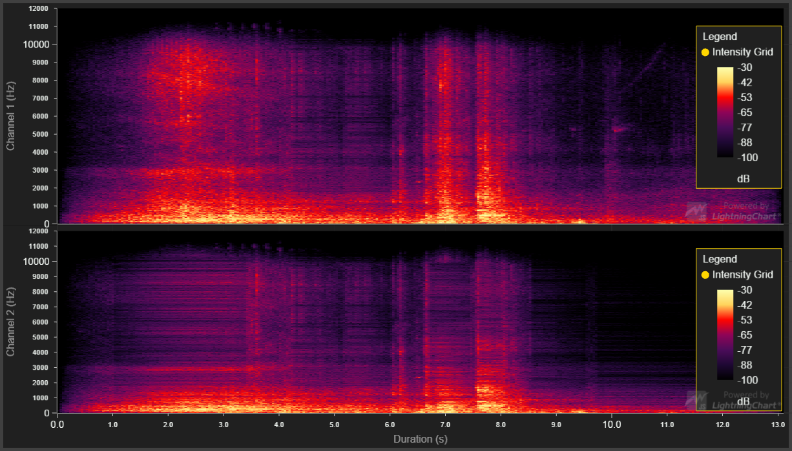

# Heatmap Spectrogram



This demo application belongs to the set of examples for LightningChart JS, data visualization library for JavaScript.

LightningChart JS is entirely GPU accelerated and performance optimized charting library for presenting massive amounts of data. It offers an easy way of creating sophisticated and interactive charts and adding them to your website or web application.

The demo can be used as an example or a seed project. Local execution requires the following steps:

- Make sure that relevant version of [Node.js](https://nodejs.org/en/download/) is installed
- Open the project folder in a terminal:

        npm install              # fetches dependencies
        npm start                # builds an application and starts the development server

- The application is available at *http://localhost:8080* in your browser, webpack-dev-server provides hot reload functionality.


## Description

This example shows a simple use case for Heatmaps as a spectrogram.

Spectrogram is a visual representation of the spectrum of frequencies. Spectrograms can be used to visualize any wave form. Most often spectrograms are used to display audio signals.

This example loads a audio file and shows spectrograms for each channel on the audio file.

The spectrogram shows frequency on one axis (Y Axis) and time on the other (X Axis). The color of a the heatmap at any point is the amplitude of the frequency at the specified time.

## Getting the data

First the audio file that will be shown is loaded with [fetch][fetch] and converted into an ArrayBuffer.

```js
const response = await fetch('url')
const buffer = await response.arrayBuffer()
```

This example uses the [Web Audio APIs][web-audio-api] to retrieve the frequency data to display in the heatmap. These APIs make it easy to work with audio files and manipulate the files. For spectrogram use the [AnalyzerNode][analyzer-node] is the most useful part of the API as it provides [getByteFrequencyData][getByteFrequencyData] method which is a implementation of [Fast Fourier Transform][fft].
The AudioContext contains method to convert an ArrayBuffer into an [AudioBuffer][AudioBuffer].

```js
const audioBuffer = await audioContext.decodeAudioData(buffer)
```

Now that the audio file is converted into a AudioBuffer it's possible to start extracting data from it.

To process the full audio buffer as fast as possible, a [OfflineAudioContext][OfflineAudioContext] is used. The OfflineAudioContext doesn't output the data to a audio device, instead it will go through the audio as fast as possible and outputs an AudioBuffer with the processed data. In this example the processed audio buffer is not used, but the processing is used to calculate the FFT data we need to display the intensities for each frequency in the spectrogram. The audio buffer we have created is used as a [buffer source][createBufferSource] for the OfflineAudioContext.

The buffer source only has a single output but we want to be able to process each channel separately, to do this a [ChannelSplitter][createChannelSplitter] is used with the output count matching the source channel count.

```js
const splitter = offlineCtx.createChannelSplitter(source.channelCount)
```

This makes it possible to process each channel separately by making it possible to create AnalyzerNodes for each channel and only piping a single channel to each analyzer.

A [ScriptProcessorNode][createScriptProcessor] is used to go through the audio buffer in chuncks. For each chunk, the FFT data is calculated for each channel and stored in large enough buffers to fit the full data.

Last [startRendering()][start-rendering] method is called to render out the audio buffer. This is when all of the FFT calculation is done.

## Showing the data

Each channel of the audio file is shown in it's own chart inside a single dashboard. When the data is calculated, a dashboard is made. This dashboard is then passed to functions that setup the charts inside the dashboard and create the heatmap series based on the script processor buffer size and fft resolution.

The data from the audio APIs is in wrong format to display in the heatmap without editing it. The heatmap data has to be mapped from the one dimensional array it was generated in to a two dimensional array. This mapping in this example is done with `remapDataToTwoDimensionalMatrix` function, this function maps the data in columns. If the heatmap was displayed vertically, then the mapping would be easier as each stride of data could just be placed as a row.

```js
// Datamapping for vertical spectrogram
const output = Array.from(Array(tickCount)).map(()=> Array.from(Array(strideSize)))
for(let row = 0; row < strideSize; row += 1){
    output[row] = arr.slice(row*strideSize, row*strideSize + strideSize)
}
```

[web-audio-api]: https://developer.mozilla.org/en-US/docs/Web/API/Web_Audio_API
[analyzer-node]: https://developer.mozilla.org/en-US/docs/Web/API/AnalyserNode
[getByteFrequencyData]: https://developer.mozilla.org/en-US/docs/Web/API/AnalyserNode/getByteFrequencyData
[fft]: https://en.wikipedia.org/wiki/Fast_Fourier_transform
[fetch]: https://developer.mozilla.org/en-US/docs/Web/API/WindowOrWorkerGlobalScope/fetch
[AudioBuffer]: https://developer.mozilla.org/en-US/docs/Web/API/AudioBuffer
[OfflineAudioContext]: https://developer.mozilla.org/en-US/docs/Web/API/OfflineAudioContext
[createBufferSource]: https://developer.mozilla.org/en-US/docs/Web/API/BaseAudioContext/createBufferSource
[createChannelSplitter]: https://developer.mozilla.org/en-US/docs/Web/API/BaseAudioContext/createChannelSplitter
[createSciptProcessor]: https://developer.mozilla.org/en-US/docs/Web/API/BaseAudioContext/createScriptProcessor
[start-rendering]: https://developer.mozilla.org/en-US/docs/Web/API/OfflineAudioContext/startRendering


## API Links

* [Intensity Series Types]
* [Intensity Grid]
* [Paletted Fill Style]
* [LUT]
* [Dashboard]


## Support

If you notice an error in the example code, please open an issue on [GitHub][0] repository of the entire example.

Official [API documentation][1] can be found on [Arction][2] website.

If the docs and other materials do not solve your problem as well as implementation help is needed, ask on [StackOverflow][3] (tagged lightningchart).

If you think you found a bug in the LightningChart JavaScript library, please contact support@arction.com.

Direct developer email support can be purchased through a [Support Plan][4] or by contacting sales@arction.com.

[0]: https://github.com/Arction/
[1]: https://www.arction.com/lightningchart-js-api-documentation/
[2]: https://www.arction.com
[3]: https://stackoverflow.com/questions/tagged/lightningchart
[4]: https://www.arction.com/support-services/

© Arction Ltd 2009-2020. All rights reserved.


[Intensity Series Types]: https://www.arction.com/lightningchart-js-api-documentation/v2.1.0/globals.html#intensityseriestypes
[Intensity Grid]: https://www.arction.com/lightningchart-js-api-documentation/v2.1.0/classes/intensitygridseries.html
[Paletted Fill Style]: https://www.arction.com/lightningchart-js-api-documentation/v2.1.0/classes/palettedfill.html
[LUT]: https://www.arction.com/lightningchart-js-api-documentation/v2.1.0/classes/lut.html
[Dashboard]: https://www.arction.com/lightningchart-js-api-documentation/v2.1.0/classes/dashboard.html

